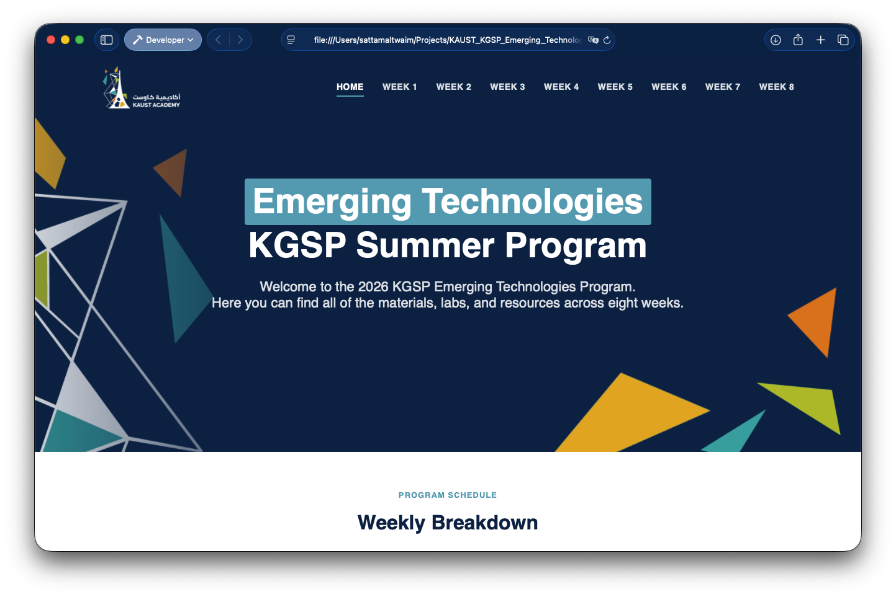

# KGSP Emerging Technologies 2026

Welcome to the **KGSP Emerging Technologies 2026** program. This repository contains all materials, labs, and resources for the eight-week course spanning data science & AI, cybersecurity & blockchain, quantum computing, cloud & edge computing, IoT, and robotics.

## Program Venue

The program is held at:

- King Abdullah University of Science and Technology (KAUST)

## 📚 Course Materials

Access the course content through our GitHub Pages site:

  

<h3 align="center">
  <a href="https://sattamaltwaim.github.io/KGSP_Emerging_Technologies_2026/">
    🔗 Access Content Website
  </a>
</h3>

---

## 📅 Schedule

The program runs over eight weeks, five days each (Sunday–Thursday).

| Week | Dates | Topic | Content |
|------|-------|-------|---------|
| Week 1 | June 21 – 25 | Data Science & Artificial Intelligence — Part 1 | [Week 1 Content](https://sattamaltwaim.github.io/KGSP_Emerging_Technologies_2026/week1/) |
| Week 2 | June 28 – July 2 | Data Science & Artificial Intelligence — Part 2 | [Week 2 Content](https://sattamaltwaim.github.io/KGSP_Emerging_Technologies_2026/week2/) |
| Week 3 | July 5 – 9 | Cybersecurity & Blockchain Technology — Part 1 | [Week 3 Content](https://sattamaltwaim.github.io/KGSP_Emerging_Technologies_2026/week3/) |
| Week 4 | July 12 – 16 | Cybersecurity & Blockchain Technology — Part 2 | [Week 4 Content](https://sattamaltwaim.github.io/KGSP_Emerging_Technologies_2026/week4/) |
| Week 5 | July 19 – 23 | Introduction to Quantum Computing | [Week 5 Content](https://sattamaltwaim.github.io/KGSP_Emerging_Technologies_2026/week5/) |
| Week 6 | July 26 – 30 | Principles of Cloud and Edge Computing | [Week 6 Content](https://sattamaltwaim.github.io/KGSP_Emerging_Technologies_2026/week6/) |
| Week 7 | August 2 – 6 | Internet of Things (IoT) | [Week 7 Content](https://sattamaltwaim.github.io/KGSP_Emerging_Technologies_2026/week7/) |
| Week 8 | August 9 – 13 | Robotics, Drones & Autonomous Systems | [Week 8 Content](https://sattamaltwaim.github.io/KGSP_Emerging_Technologies_2026/week8/) |

## License

Licensed under GPL-3.0.

> ⚠️ **Important:** Recording and uploading lectures online is not permitted.
